# tpod

> **Beta.** tpod is early and currently only supports **Podman on Linux**. Docker and other platforms may work but are untested during this phase.

Disposable container environments driven by composable profiles: declare tools, mounts, and caches once, then `tpod <profile>` spawns the container, runs your command, and removes it on exit — with a persistent [mise](https://mise.jdx.dev/) toolchain shared across runs.

`tpod opencode` spins up a container, mounts your current directory, runs the agent, and removes the container on exit. The next run is instant — mise, your tools, and your caches are already warm in shared volumes.



## Why

Every developer eventually writes scripts that launch containers with the right mounts, SSH keys, caches, tool versions, and AI agents. tpod replaces them with **user-owned, reusable profiles** that follow you to every project without repo changes.

Unlike [devcontainers](https://containers.dev/) (project-owned, checked into the repo), tpod profiles are user-owned:

- Live in `~/.config/tpod/` — no repo changes needed.
- Declare tools via mise entries, not image layers — no rebuild when a version bumps.
- Fresh container each run, removed on exit; shared volumes keep installs and caches warm.

## Install

```
mise use -g github:jgillich/tpod
```

Or build from source (requires Go):

```
go install github.com/jgillich/tpod/cmd/tpod@latest
```

Point `DOCKER_HOST` at a **rootless Podman** socket for the best experience (correct file ownership and host-path parity); Docker and rootful Podman also work but mount the workspace at `/workspace` as root — see [Runtime modes](#runtime-modes).

## Basic usage

tpod-owned flags come **before** the profile name; everything after is passed verbatim to the profile's command.

```sh
$ tpod opencode     # run the opencode agent, then remove the container
$ tpod shell        # a disposable shell with the right tools on PATH
```

The first launch pulls the base image, builds the profile's derived image (system packages), and installs tools (slow). Subsequent launches reuse them (instant).

### `tpod init`

`tpod init` generates a user profile that merges a base profile and selected **fragments** (SSH keys, git config, package caches):

```sh
$ tpod init opencode
```

### Other commands

```sh
tpod doctor              # diagnose runtime, mise, volumes, configs, workspace
tpod prune               # remove catalog-unused tpod resources (volumes + derived images)
```

## Profiles

A profile is a YAML file. Built-ins are embedded in the binary; user profiles live in `~/.config/tpod/profiles/` and shadow built-ins of the same name.

```yaml
# ~/.config/tpod/profiles/myagent.yaml
version: 1
extends: opencode          # inherit everything, then override below
command: ["myagent", "--serve"]   # replaces the inherited command
tools:
  opencode: "0.11.2"       # pin a version (overrides inherited "latest")
  node: "22"
packages:
  - libxml2-dev            # apt packages installed in the derived image
mounts:
  ~/src/shared-lib:        # mount a directory into the container home
    source: ~/src/shared-lib
    read_only: true
caches:
  npm: ~/.npm
environment:
  OPENAI_API_KEY: '{{ .Env.OPENAI_API_KEY }}'   # forward a host variable
```

If a project has its own `mise.toml`, tpod's shell picks it up as an override; otherwise the profile's `tools:` map stands alone.

### Built-in profiles

| Profile | Command | What it is |
| --- | --- | --- |
| `mise` | `mise` | Shared base profile: installs the mise toolchain plus common CLI tools (bat, fzf, jq, ripgrep…). Everything else extends it. |
| `opencode` | `opencode` | The opencode AI agent |
| `codex` | `codex` | OpenAI Codex CLI |
| `claude` | `claude` | Anthropic Claude Code |
| `gemini` | `gemini` | Google Gemini CLI |
| `pi` | `pi` | Pi, the minimal terminal coding agent (earendil-works) |
| `crush` | `crush` | Crush, the Charmbracelet terminal coding agent |
| `qwen` | `qwen` | Qwen Code CLI (Alibaba) |
| `buzz` | `buzz` | Buzz, Block's desktop AI agent (GUI) |
| `t3code` | `t3code` | T3 Code desktop app — agent harness control surface |
| `shell` | `bash` | Disposable, project-aware shell. Useful as a base to `extends:` |

All built-ins extend the shared `mise` base profile and install their agent as a `tools:` entry.

### Schema reference

Every field is optional except `version`, `image`, and `command`.

| Field | Type | Description |
| --- | --- | --- |
| `version` | int | Config schema version. Currently `1`. |
| `extends` | string \| list | Inherit from another profile or fragment, then deep-merge. Cycles are rejected; fragments may only extend fragments. |
| `image` | string | Container image. |
| `packages` | string[] | Apt packages installed in a derived image, built on first use and reused. |
| `repos` | map | Extra apt sources (`extrepo: <name>`), resolved at build time for the base image's Debian version. |
| `files` | map | Files written into the container at launch, keyed by target path. Each entry: `content` (inline, `{{ }}` templates), `mode` (default `0644`). |
| `command` | string[] | Command to run. User args on the CLI replace the default args. |
| `mounts` | map | Bind mounts, keyed by container target. `source`, `read_only` (default `true`), `optional`, `create`. `~` in `source` → host `$HOME`; `~` as key → runtime home. |
| `caches` | map | Named-volume-backed cache dirs, shared across all profiles. |
| `tools` | map | mise-managed tools, keyed by name; value is the version. |
| `environment` | map | Env vars. Forward a host variable with `'{{ .Env.FOO }}'`. |
| `ports` | map | Publish container ports to the host. Key is the container port; `host` optional (`0` = random). Allocated host ports are available to templates via `.Ports`. |
| `devices` | map | Attach host device nodes (e.g. `/dev/fuse`). Optional `permissions` (`r`/`rw`/`rwm`) and `cgroup`. |
| `labels` | map | Container labels (`profile` is set automatically). |
| `network` | string | `bridge` (default), `host`, `none`, or a custom name. |
| `resources` | object | Optional hints: `{ memory, cpus }`. Best-effort. |
| `tty` | string | `auto` (default), `true`, or `false`. |
| `dbus` | object | Session-bus allowlist: `talk` / `own`, each a map of bus names. |

### Merge semantics

- **Scalars:** child replaces parent.
- **Maps:** merged key-by-key; set a key to `null` to delete an inherited entry.
- **`command`:** replaced, not concatenated.
- **`packages`:** additive with dedup; `packages: null` clears the inherited list.
- **`image`:** single slot; setting it clears the other.

### System packages (`packages:`)

The base image ships the bare OS. Per-profile system libraries are installed into a **derived image** (base + the profile's package list) that tpod builds on first use and reuses; profiles with identical lists share one image. Packages outside Debian's archive need a `repos:` entry:

```yaml
repos:
  mise: { extrepo: mise }   # enables https://mise.jdx.dev/deb
```

If your engine can't build images, use a custom `image:` that already includes your packages and omit `packages:`.

### Writing files at launch (`files:`)

`files:` writes inline-content files into the ephemeral container before the command runs — owned by the execution user, gone when the container exits. Targets are absolute or `~`-prefixed; content is a `{{ }}` template (`.Env`, `uid`, `.Ports`).

### Inspecting profiles

```sh
$ tpod show shell            # raw on-disk profile
$ tpod list                  # every profile and fragment
$ tpod edit myagent          # open in $EDITOR
```

## Fragments

Fragments are small, composable building blocks — a tool's cache, a host config mount, a credential set. `tpod init` merges selected fragments into a user profile. Built-in fragment mounts are `optional: true`, so missing host paths are skipped with a warning. Fragments may extend other fragments but never profiles.

## Runtime modes

tpod talks to any Docker-API-compatible engine via `DOCKER_HOST`:

- **Rootless Podman (recommended):** workspace at its host absolute path, agent runs as your host user. Paths and file ownership match exactly.
- **Docker / rootful Podman:** workspace at `/workspace`, agent runs as root. Files are root-owned — use `sudo chown` or switch to rootless Podman.

`tpod doctor` reports which mode is active.

## License

Licensed under the [Mozilla Public License Version 2.0](LICENSE). Copyright (c) 2026 Jakob Gillich.
