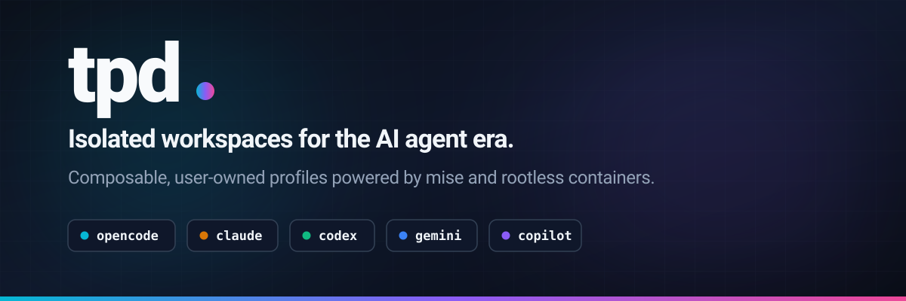

# tpd

> **Beta.** tpd is early and currently targets **rootless** containers on **Linux**. Rootful containers are supported on a best-effort basis.

Composable profiles declare tools, mounts, and caches once. `tpd opencode` then mounts your current directory and any configured credentials, runs the command in a fresh container, and removes it on exit. A persistent [mise](https://mise.jdx.dev/) toolchain and shared volumes keep installs and caches warm across runs.

<picture>
  <source media="(prefers-color-scheme: light)" srcset="./assets/banner-light.svg">
  <source media="(prefers-color-scheme: dark)" srcset="./assets/banner-dark.svg">
  
</picture>

## Why

Every developer eventually writes scripts that launch containers with the right mounts, config files, caches, tool versions, and AI agents. tpd replaces them with **user-owned, reusable profiles** that follow you to every project without repo changes.

Unlike [devcontainers](https://containers.dev/) (project-owned, checked into the repo), tpd profiles are user-owned:

- Live in `~/.config/tpd/` — no repo changes needed.
- Declare tools via mise entries, not image layers — no rebuild when a version bumps.
- Fresh container each run, removed on exit; shared volumes keep installs and caches warm.

## Install

tpd is installed through [mise](https://mise.jdx.dev/), so install mise first:

```sh
curl https://mise.jdx.dev/install.sh | sh
```

This installs mise to `~/.local/bin` and wires up shell activation; restart your shell (or see the [installation docs](https://mise.jdx.dev/installing-mise.html)). Then install tpd:

```sh
mise use -g github:jgillich/tpd
```

Or build from source (requires Go):

```
go install github.com/jgillich/tpd/cmd/tpd@latest
```

Enable shell completions:

```sh
echo 'source <(tpd completion bash)' >> ~/.bashrc && source ~/.bashrc
```

tpd uses the Docker API, so configure `DOCKER_HOST` for the engine you want to use. For the recommended rootless Podman setup, start the user socket and point the client at it:

```sh
systemctl --user enable --now podman.socket
export DOCKER_HOST="unix://$XDG_RUNTIME_DIR/podman/podman.sock"
```

See [Runtime modes](#runtime-modes) for the differences between rootless and rootful engines.

## Basic usage

tpd-owned flags come **before** the profile name; everything after is passed verbatim to the profile's command. Use `tpd --help` for the complete CLI reference.

```sh
$ tpd opencode     # run the opencode agent, then remove the container
$ tpd bash         # a disposable bash shell with the right tools on PATH
```

The first launch pulls the base image, builds the profile's derived image when system packages are declared, and installs tools (slow). Subsequent launches reuse these resources when possible.

`tpd launch --pull <profile>` re-pulls the base image even when it is already present locally, refreshing mutable tags (`latest`); the derived image is rebuilt automatically when the new base's ID changes its content hash.

### `tpd init`

`tpd init` generates a user profile that merges a base profile and selected **fragments** (SSH keys, git config, package caches). With a terminal it starts an interactive wizard; explicit arguments are useful for scripts:

```sh
$ tpd init opencode --extends=javascript,gitconfig,ssh
```

### Other commands

```sh
tpd doctor              # diagnose runtime, mise, volumes, configs, workspace
tpd prune               # remove catalog-unused tpd resources (volumes + derived images)
```

## Profiles

A profile is a YAML file. Built-ins are embedded in the binary; user profiles live in `~/.config/tpd/profiles/` and shadow built-ins of the same name.

```yaml
# ~/.config/tpd/profiles/myagent.yaml
version: 1
extends: opencode          # inherit everything, then override below
command: ["opencode", "--verbose"] # replaces the inherited command
tools:
  opencode: "0.11.2"       # pin a version (overrides inherited "latest")
  node: "22"
packages:
  - libxml2-dev            # apt packages installed in the derived image
mounts:
  ~/src/shared-lib:        # mount a directory into the container home
    source: ~/src/shared-lib
    read_only: true
caches:
  npm: ~/.npm
environment:
  OPENAI_API_KEY: '{{ .Env.OPENAI_API_KEY }}'   # forward a host variable
```

If a project has its own `mise.toml`, tpd's bash profile picks it up as an override; otherwise the profile's `tools:` map stands alone.

### Built-in profiles

| Profile | What it is |
| --- | --- |
| [`mise`](internal/catalog/profiles/mise.yaml) | Shared base profile: installs the mise toolchain plus common CLI tools (bat, fzf, jq, ripgrep…). Everything else extends it. |
| [`amp`](internal/catalog/profiles/amp.yaml) | Sourcegraph Amp coding agent |
| [`opencode`](internal/catalog/profiles/opencode.yaml) | The opencode AI agent |
| [`codex`](internal/catalog/profiles/codex.yaml) | OpenAI Codex CLI |
| [`claude`](internal/catalog/profiles/claude.yaml) | Anthropic Claude Code |
| [`gemini`](internal/catalog/profiles/gemini.yaml) | Google Gemini CLI |
| [`pi`](internal/catalog/profiles/pi.yaml) | Pi, the minimal terminal coding agent (earendil-works) |
| [`crush`](internal/catalog/profiles/crush.yaml) | Crush, the Charmbracelet terminal coding agent |
| [`qwen`](internal/catalog/profiles/qwen.yaml) | Qwen Code CLI (Alibaba) |
| [`copilot`](internal/catalog/profiles/copilot.yaml) | GitHub Copilot CLI |
| [`buzz`](internal/catalog/profiles/buzz.yaml) | Buzz, Block's desktop AI agent (GUI) |
| [`t3code`](internal/catalog/profiles/t3code.yaml) | T3 Code desktop app — agent harness control surface |
| [`bash`](internal/catalog/profiles/bash.yaml) | Disposable bash shell. |

Most agent built-ins extend the shared `mise` base profile and install their agent as a `tools:` entry. `mise` is the shared base and `bash` is the general-purpose shell profile.

### Schema reference

Every launchable profile needs `version`, `image`, and `command`. Fragments only need `version` and may omit the profile identity fields.

| Field | Type | Description |
| --- | --- | --- |
| `version` | int | Config schema version. Currently `1`. |
| `extends` | string \| list | Inherit from another profile or fragment, then deep-merge. Cycles are rejected; fragments may only extend fragments. |
| `image` | string | Container image. |
| `packages` | string[] | Apt packages installed in a derived image, built on first use and reused. |
| `repos` | map | Extra apt sources (`extrepo: <name>`), resolved at build time for the base image's Debian version. v1 supports extrepo entries; custom URL repositories are not yet buildable. |
| `files` | map | Files written into the container at launch, keyed by target path. Each entry: `content` (inline, `{{ }}` templates), `mode` (default `0644`). |
| `command` | string[] | Command to run. User args on the CLI replace the default args. |
| `mounts` | map | Bind mounts, keyed by container target. `source`, `read_only` (default `true`), `optional`, `create`. `~` in `source` → host `$HOME`; `~` as key → runtime home. |
| `caches` | map | Named-volume-backed cache dirs, shared across all profiles. |
| `tools` | map | mise-managed tools, keyed by name; value is the version. `appimage:` tools stay on `latest` and are digest-verified at install (against GitHub's per-asset digest or a checksum sidecar); an explicit `sha256` or per-arch `sha256: {amd64, aarch64}` is optional. |
| `environment` | map | Env vars. Forward a host variable with `'{{ .Env.FOO }}'`. |
| `ports` | map | Publish container ports to the host. Key is the container port; `host` optional (`0` = random). Allocated host ports are available to templates via `.Ports`. |
| `devices` | map | Attach host device nodes (e.g. `/dev/fuse`). Optional `permissions` (`r`/`rw`/`rwm`) and `cgroup`. |
| `labels` | map | Container labels (`profile` is set automatically). |
| `network` | string | `bridge` (default), `host`, `none`, or a custom name. |
| `resources` | object | Optional resource limits: `{ memory, cpus }`, enforced as container resource limits (Docker `--memory`/`--cpus` semantics). |
| `tty` | string | `auto` (default), `true`, or `false`. |
| `dbus` | object | Session-bus allowlist: `talk` / `own`, each a map of bus names. |

### Merge semantics

- **Scalars:** child replaces parent.
- **Maps:** merged key-by-key; set a key to `null` to delete an inherited entry.
- **`command`:** replaced, not concatenated.
- **`packages`:** additive with dedup; `packages: null` clears the inherited list.

### System packages (`packages:`)

The base image ships the bare OS. Per-profile system libraries are installed into a **derived image** (base + the profile's package list) that tpd builds on first use and reuses; profiles with identical lists share one image. Packages outside Debian's archive need a supported `repos:` entry:

```yaml
repos:
  mise:
    extrepo: mise # enables https://mise.jdx.dev/deb
```

Custom URL repositories are schema-ready but currently rejected during image preparation.

If your engine can't build images, use a custom `image:` that already includes mise and the required packages, and clear inherited package/repository declarations:

```yaml
image: my-image:latest
packages: null
repos: null
```

### Writing files at launch (`files:`)

`files:` writes inline-content files into the ephemeral container before the command runs — owned by the execution user, gone when the container exits. Targets are absolute or `~`-prefixed; content is a `{{ }}` template (`.Env`, `uid`, `.Ports`).

### Inspecting profiles

```sh
$ tpd show bash            # profile definition before resolving extends
$ tpd list                  # every profile and fragment
$ tpd edit myagent          # open in $EDITOR
```

## Fragments

Fragments are small, composable building blocks — a tool's cache, a host config mount, or a credential set. `tpd init` merges selected fragments into a user profile. Built-in fragment mounts are `optional: true`, so missing host paths are skipped with a warning. Fragments may extend other fragments but never profiles.

User configuration lives below `$XDG_CONFIG_HOME/tpd/` (normally `~/.config/tpd/`): profiles are in `profiles/` and fragments are in `fragments/`. User profiles shadow built-ins with the same name; name collisions between profiles and fragments are errors.

Project-local `mise.toml` and `.tool-versions` files are discovered after tpd changes into the workspace, and override profile-level `tools:` for that launch.

## Security

Profiles are user-owned configuration, but they can grant substantial host access. Review mounts, forwarded environment variables, credential files, devices, published ports, GUI/D-Bus access, and container sockets before launching a profile. `files:` writes only into the ephemeral container; bind mounts and named caches can persist or expose host data.

GUI support is split into two fragments: `gui` mounts the display, `/dev/dri`, and the specific Wayland socket, while `gui-runtime` additionally mounts the entire `$XDG_RUNTIME_DIR` (needed by buzz/t3code). Prefer `gui` alone unless the app needs the runtime dir.

See [the security model](docs/2026-08-03-security-model.md) for the trust model, ownership labels and prune semantics, the AppImage digest-verification policy, and the accepted trade-offs (extrepo TLS trust anchor, SELinux `label=disable`, setpriv-absent root fallback, host-port allocation).

## Runtime modes

tpd talks to a Docker-API-compatible engine via `DOCKER_HOST`:

- **Rootless Podman (recommended):** workspace is mounted at its host absolute path and the command runs as your host user. Paths and file ownership match exactly.
- **Docker / rootful Podman:** workspace is mounted at `/workspace`; tpd drops to the host UID when the image provides `setpriv`, with a root fallback when it does not. This mode cannot provide the same host-path parity as rootless Podman.

`tpd doctor` reports which mode is active.

Named caches are stored in engine-managed volumes and shared across profiles by cache name. On engines without volume-subpath support, tpd uses a separate fallback volume for each cache path.

## License

Licensed under the [Mozilla Public License Version 2.0](LICENSE). Copyright (c) 2026 Jakob Gillich.
